# 신규 프로젝트 - 실무 과정에서 수행한 프로젝트
# 신규 프로젝트에서 배포물을 통한 조작이 가능합니다.

[👉 여기를 클릭하면 신규 프로젝트로 이동합니다](https://github.com/soyello/self-project)
- 위 프로젝트는 가장 최신 작업물로 배포물을 직접 확인이 가능합니다.
- 하기 프로젝트 (본 프로젝트)는 연습용 프로젝트로 현재도 지속적으로 수정 중이며 보완 예정입니다.

# 기존 프로젝트 - Next.js로 중고마켓 페이지 제작

## 1. Page routing 기반으로 제작

## 2. 인증 및 인가 기능 구현

- MySQL과 NextAuth 사용하여 구현
- middleware를 통해 권한이 있는 사용자만 admin, user 페이지 접근 가능
- 로그인 이후 user의 token, session 생성

  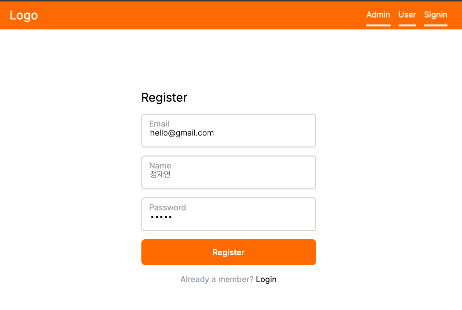
  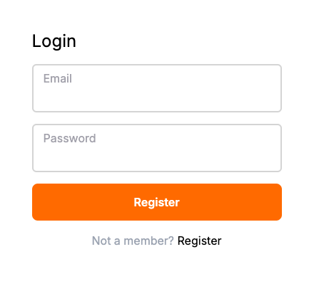

## 3. 상품 업로드 페이지

- Cloudinary를 사용한 이미지 업로드 기능
  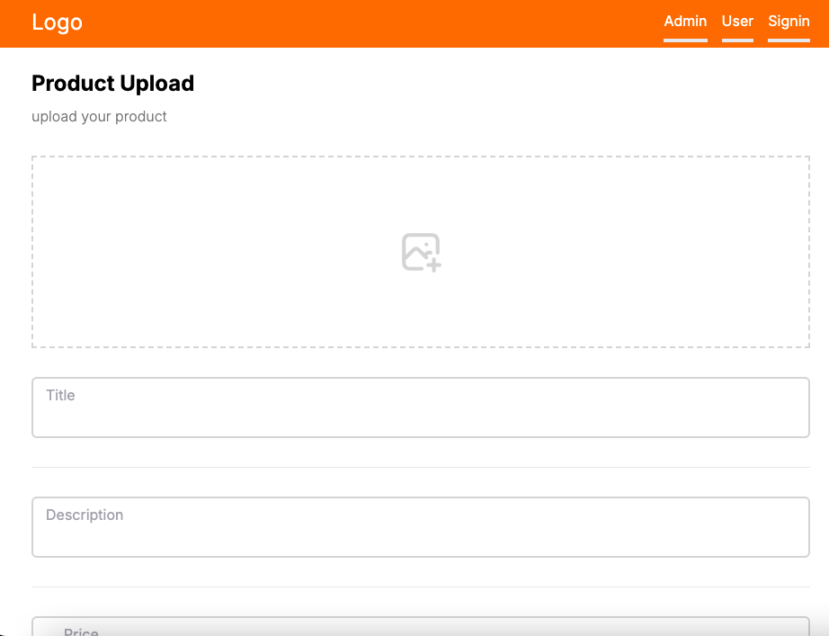
  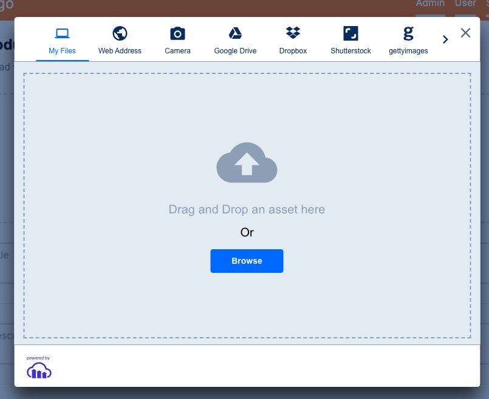

- Kakao Map을 사용한 지역 설정 기능
  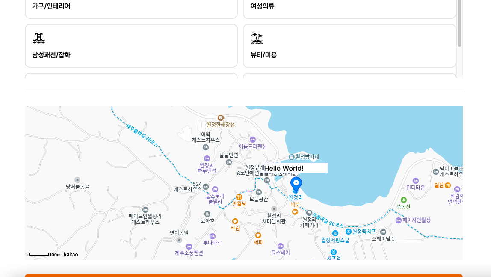

- 카테고리 설정 기능
  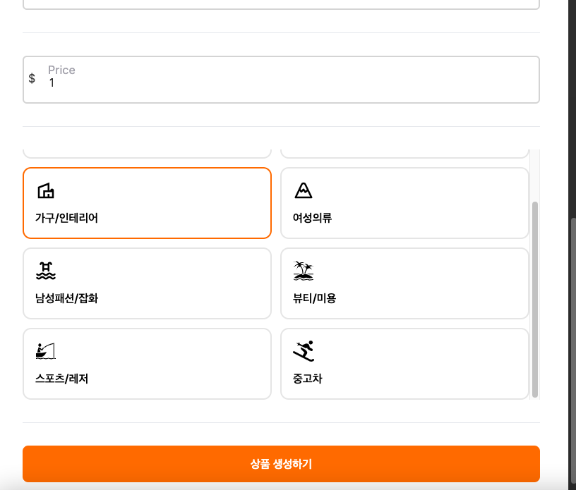

## 4. 홈페이지

- Product Card 생성
- Favorite 기능 구현
  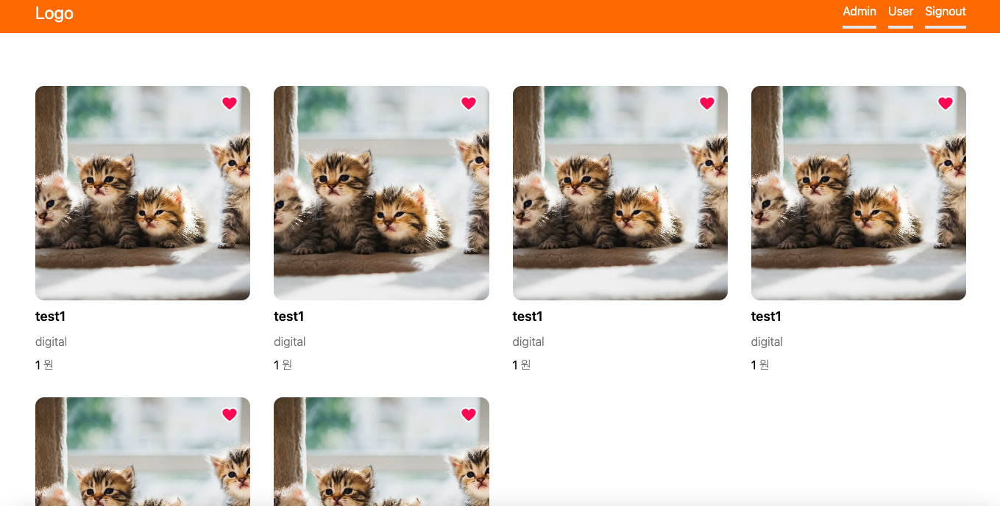

- 카테고리 분류 기능 구현
  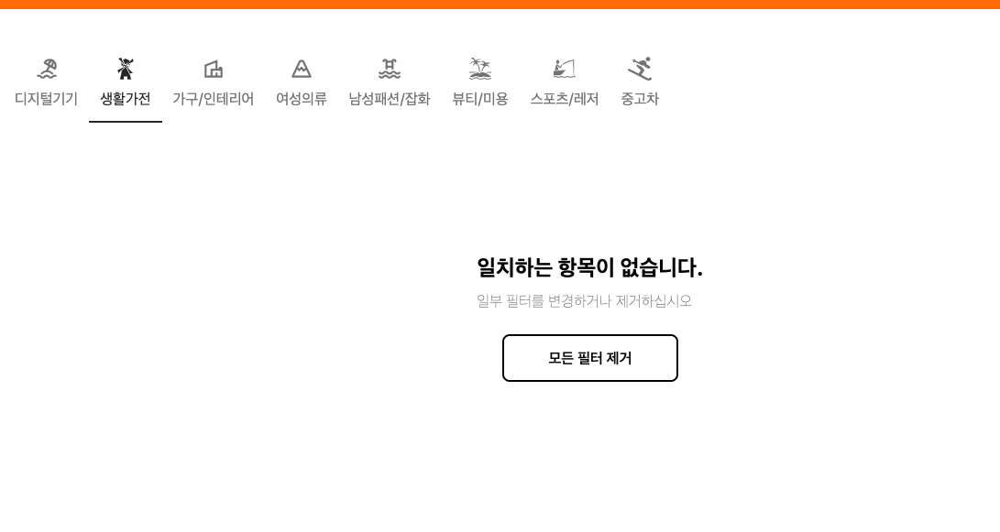

- Pagination 기능 구현

## 5. 상품 상세 페이지

- 상세 이미지
- 지정 위치 및 기타 데이터 확인

  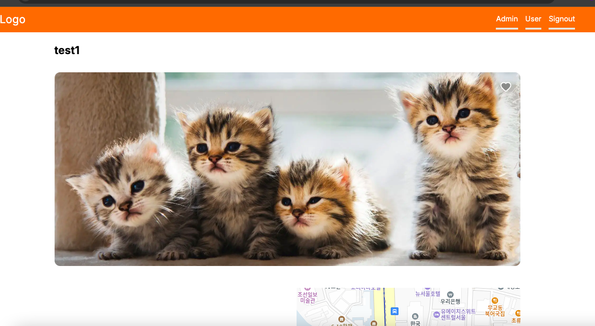
  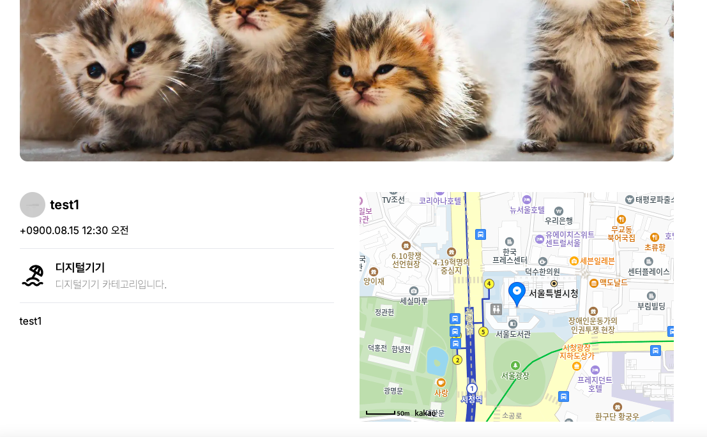

## 6. 채팅 페이지

- useSWR 사용
- User 정보
- 입력창 구현 - string, image 입력 기능

  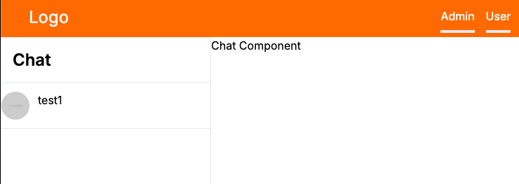
  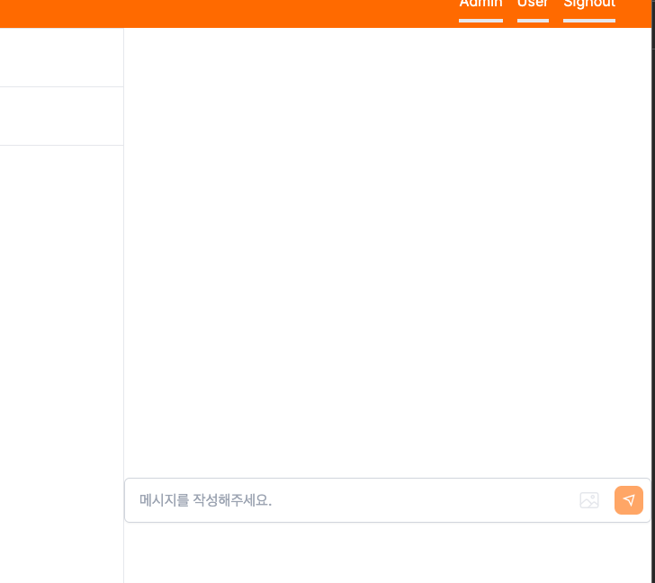
  
